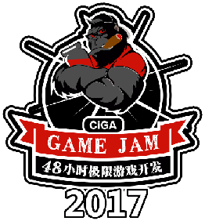
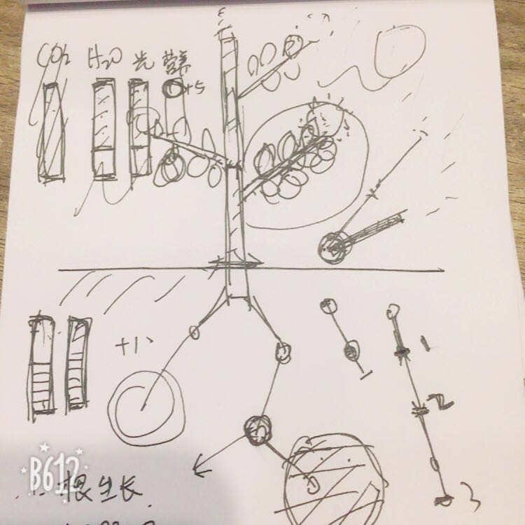
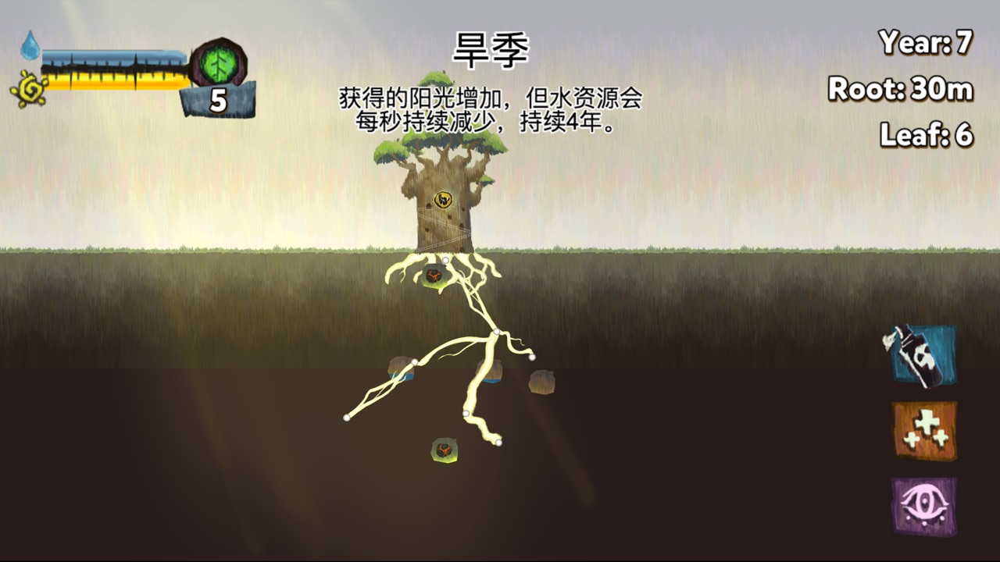
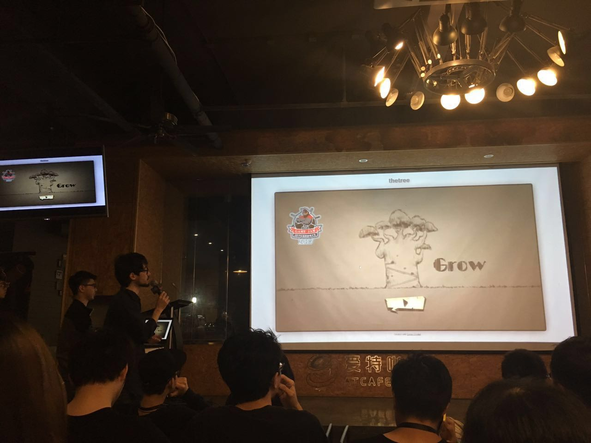

# CiGA Game Jam 2017 The Tree 游戏设计文档

## 游戏概要

这是一棵树的生长故事，它生根散叶，不断壮大自己并探索周围环境，尽可能吸取更多养分，对抗有害的环境，最终成为星球的主人。

## 游戏玩法

作为模拟经营游戏，玩家需要平衡不同资源的获取和消耗，来产生富余的资源来让自己生长。

### 核心玩法

通过按住根节点并拖拽，可以向一个方向长出新的树根，生长的长度越大，消耗的营养越多。每次生长的长度由当前所有的营养数量限制，会根据玩家拖拽的距离来向上或向下取整到一个整数营养值对应的长度。

### 视野探索

树根在生长的时候会探知一定区域内周围的环境，展示从起始节点到终点节点一定半径内所有元素。已经探知的元素会一直出现在玩家视野里，未被探知的元素不可见。

### 元素

元素分为资源、中立、敌对几类。 资源类的元素在接触树根时会为树提供一定量的资源。 中立的元素不可穿过，也没有其他效果。敌对元素会对树根造成伤害，需要消灭或避开。

### 树叶生长

除了树根，营养还能用来生出树叶，点击树枝上的树叶按钮就会消耗营养长出树叶。树叶会持续提供光能。每个树枝上可以长出一定数量的叶子（6-8），当营养足够的时候，树会向上长高，也会生出更多树枝。

### 营养合成

树叶提供光能，树根提供水，光能和水的储备各有一个进度条来表示，当光能和水都累积到最高值时，就会清空进度条并生成一单位的营养。营养可以持续储备，并用来生长树根或树叶。

### 果实

当叶子达到一定数量后，消耗营养可以在树枝上结出果实。果实掉落后会吸引动物来吃，在近地面的土壤中增加粪便或尸体。果实也可以点击收集后用于交换道具。

## 策略和挑战

首先最重要的是几种资源的平衡，光和水要均衡增长才能生成营养，营养的利用也要留有余地，以面对各种突发状况。

可能遇到的突发情况包括：

- 阴天：光能减半
- 下雨：光能减半，以一定速率增加水资源
- 暴晒：光能增加，以一定速率消耗水资源

以下元素会对树根造成影响：

- 肥料（包括动物尸体，粪便等）：直接获得一定营养
- 毒素：使一定长度的树根无法吸收水分
- 害虫：吃掉一定长度的树根
- 石头：无法穿过，只能绕开

### 使用道具

可以用果实交换的道具包括：

- 杀虫剂：清除一个害虫。
- 解毒剂：取消一段树根上毒素的影响。
- 雷达：探知一片圆形区域。

### 成就系统

取得阶段性成果时会解锁成就，包括：

- 树根第一次接触水源
- 长出 N 片树叶
- 树根总长度达到 XX
- 长出第一个果实
- 长到一定高度

